# Оглавление

- [Лабораторная работа №1: Разработка пользовательского интерфейса (GUI) для языкового процессора]([#лабораторная-работа-1-разработка-пользовательского-интерфейса-gui-для-языкового-процессора))
- [Лабораторная работа №2: Разработка лексического анализатора (сканера)](#лабораторная-работа-2-разработка-лексического-анализатора-сканера))
- [Лабораторная работа №3: Разработка синтаксического анализатора (парсера)](#лабораторная-работа-3-разработка-синтаксического-анализатора-парсера)

# Лабораторная работа №1. Разработка пользовательского интерфейса (GUI) для языкового процессора

## Цель работы: 
Cоздание кроссплатформенного графического интерфейса (GUI) для языкового процессора в виде специализированного текстового редактора.
## Описание проекта
**Text Editor** — это многофункциональный текстовый редактор.

Приложение предоставляет работу с несколькими документами, подсветку синтаксиса, встроенную справочную систему (HTML), запуск анализа текста.
## **Автор:** 

 Cтудент группы АВТ-313 Геращенко Антон Евгеньевич

## Используемые технологии:

Язык программирования: **C#**

GUI фреймворк: **Windows Forms**.

IDE: **Visual Studio**.

## Инструкция по сборке и запуску: 
Путь к исполняемому файлу: "..\bin\Debug\net9.0-windows\compiles_lab_1.exe"

# Руководство пользователя:
## Главное окно приложения
Главное окно Text Editor включает меню, панель инструментов, область вкладок, текстовую область с подсветкой синтаксиса и нижнюю панель вывода результатов. Интерфейс выполнен в минималистичном стиле и ориентирован на удобство работы с несколькими документами.
### Интерфейс программы
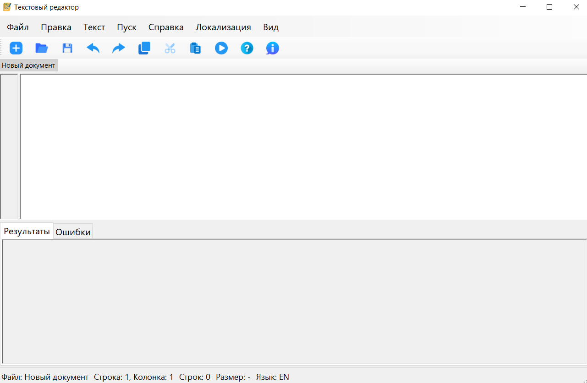

## Меню «Файл»

1) Создать **(Ctrl+N)** — создаёт новый пустой документ во вкладке.
2) Открыть **(Ctrl+O)** — открывает текстовый файл с диска.
3) Сохранить **(Ctrl+S)** — сохраняет текущий документ.
4) Выход **(Alt+F4)** — завершает работу программы.

### Вид меню «Файл»
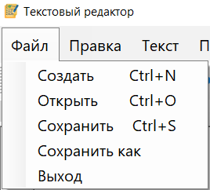

## Меню «Правка»

1) Отменить **(Ctrl+Z)** — отменяет последнее действие.
2) Повторить **(Ctrl+Y)** — повторяет отменённое действие.
3) Вырезать **(Ctrl+X)** — вырезает выделенный текст.
4) Копировать **(Ctrl+C)** — копирует выделенный текст.
5) Вставить **(Ctrl+V)** — вставляет текст из буфера обмена.
6) Удалить **(Del)** — удаляет выделенный фрагмент.
7) Выделить всё **(Ctrl+A)** — выделяет весь текст документа.
> Каждая вкладка имеет независимую историю Undo/Redo, что позволяет работать с несколькими документами без конфликтов.

### Вид меню «Правка»
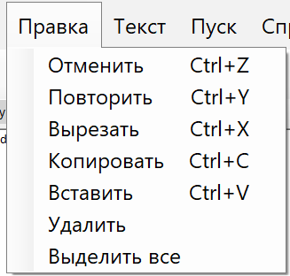

## Вкладки
Приложение поддерживает одновременную работу с несколькими документами.

> Одновременно можно работать с не более ***14*** файлами

1) Создание вкладки — через «Файл → Создать».
2) Закрытие вкладки — кнопка «×» или ПКМ → «Закрыть вкладку».
3) Переключение вкладок — кликом мыши. 

### Расположение вкладок
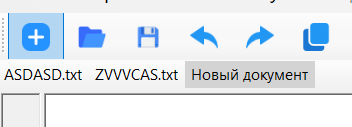

## Панель инструментов
На панели расположены кнопки:

1) *New* — создать документ
2) *Open* — открыть файл
3) *Save* — сохранить
4) *Undo / Redo*
5) *Cut / Copy / Paste*
6) *Run — запуск анализа текста*

### Панель инструментов


## Локализация интерфейса
Меню: Language → Русский / English

### Локализованный интерфейс
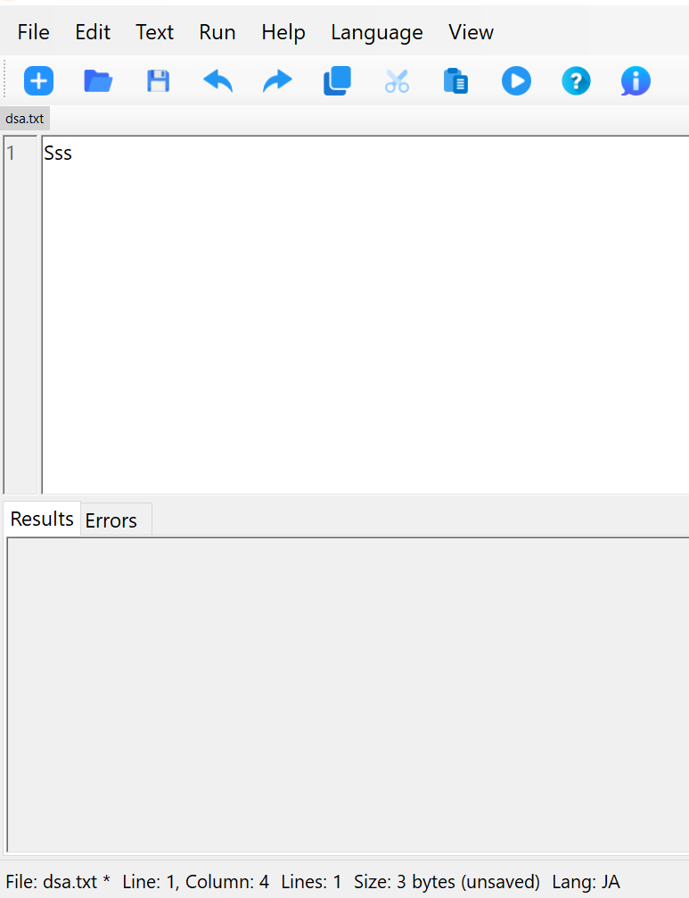

## Подсветка синтаксиса
Редактор выполняет базовую подсветку синтаксиса

### Интерфейс с подсвеченным синтаксисом
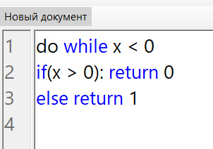

## Встроенная справочная система
Меню:
1)  Вызов справки **(F1)** - Открывает справку программы
2)  О программе **(CTRL + F1)** - Открывает окно с информацией о разработчике и версии.

### Раздел помощи
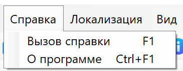

# Лабораторная работа №2. Разработка лексического анализатора (сканера)

## Цель работы: 
Изучить назначение и принципы работы лексического анализатора в структуре компилятора. Спроектировать алгоритм (диаграмму состояний) и выполнить программную реализацию сканера для выделения лексем из входного текста. Интегрировать разработанный модуль в ранее созданный графический интерфейс языкового процессора.

## **Автор:** 

 Cтудент группы АВТ-313 Геращенко Антон Евгеньевич

## Постановка задачи:
Разработать лексический анализатор (сканер) в соответствии с индивидуальным вариантом задания,
интегрировать его в приложение из лабораторной работы №1 и обеспечить наглядный вывод результатов; разработать грамматику , cгенерировать код лексера и парсера для анализа грамматики с помощью программного обеспечения FLEX&BISON, а затем внедрить и протестировать в программе.
  
# Вариант задания:
Вариант №40. Объявление целочисленной константы с инициализацией **(Kotlin)**
### Примеры корректных входных данных:
1) **const val x: Int = 10;**
2) **const val number: Int = -5;**
3) **const val index123: Int = 0;**
Допустимые лексемы: { 'const', 'val', 'Int', идентификатор, целое_число, '−', ':', '=', ';' }
  
# Диаграмма состояний:

## Описание:
Автомат начинает работу в состоянии Start (0) и далее, в зависимости от первого символа, выбирает ветку анализа:
1) цифра → целое число
2) буква → идентификатор или ключевое слово (Int, val, const)
3) ':' → оператор ':'
4) '=' → оператор '='
5) ';' → оператор ';'
6) '-' → оператор '-'
7) пробел → разделитель
8) Любой другой символ → **ошибка**
### Каждое состояние либо:
1) продолжает чтение (цикл), либо
2) завершает токен и возвращает его код.

# Тестовые примеры:
**Пример №1: корректная входная строка**

**Пример №2: некорректная входная строка**

**Пример №3: многострочность**

# Разработанная грамматика на основе варианта:
```
Vₜ = { 'a'..'z', 'A'..'Z', '0'..'9', ':', '=', ';', ' ', '-'}
 Vₙ = {
    <Программа>,
    <Список объявлений>,
    <Объявление>,
    <Идентификатор>,
    <Целое число>,
    <Положительное число>,
    <Ненулевая цифра>
    <Буква>,
    <Цифра>
 }

S = <Программа>

<Программа> → <Список объявлений>

<список объявлений> → <Объявление>
<Список объявлений> → <Список объявлений> <Объявление>

<Объявление> → 'const' 'val' <Идентификатор> ':' 'Int' '=' <Целое xисло> ';'

<Идентификатор> → <Буква>
<Идентификатор> → <Идентификатор> <Буква>
<Идентификатор> → <Идентификатор> <Цифра>

<Целое число> → '0'
<Целое число> → <Положительное число>
<Целое число> → '-'<Положительное число>

<Положительное число> → <Цифра>
<Положительное число> → <Положительное число> <Цифра>


<Буква> → 'a' | 'b' | ... | 'z' | 'A' | ... | 'Z'
<Цифра> → '0' | '1' | ... | '9'
<Ненулевая цифра> → '1' | ... | '9'
```
## Классификация грамматики
Тип: контекстно‑свободная грамматика (тип 2 по Хомскому). Так как сушествует правило, где в правой части произвольная последовательность терминалов и нетерминалов: <Идентификатор> → <Идентификатор> <Цифра>, но при этом в левой части всегда один нетерминальный символ. 
# Грамматика для FLEX:
```
%{
    #include "grammar.tab.h"
%}

%option noyywrap

%%

"const"        { return T_CONST; }
"val"          { return T_VAL; }
"Int"          { return T_INT; }

":"            { return T_COLON; }
"="            { return T_ASSIGN; }
";"            { return T_SEMI; }

-0[0-9]*      { fprintf(stderr, "Lexical error: invalid integer '%s'\n", yytext); exit(1); }

"-"            { return T_MINUS; }

0                 { yylval.intValue = 0; return T_INTLIT; }
[1-9][0-9]*         { yylval.intValue = atoi(yytext); return T_INTLIT; }

[a-zA-Z][a-zA-Z0-9]*  {
                        yylval.strValue = strdup(yytext);
                        return T_IDENT;
                     }

[ \t\r\n]+     {  }

. {
    fprintf(stderr, "Lexical error: unexpected character '%s'\n", yytext);
    exit(1);
}
%%
```
# Грамматика для BIZON:
```
%{
    #include <stdio.h>
    #include <stdlib.h>

    void yyerror(const char* s);
    int yylex(void);
%}

%union {
    int intValue;
    char* strValue;
}

%token T_CONST T_VAL T_INT
%token <strValue> T_IDENT
%token <intValue> T_INTLIT
%token T_COLON T_ASSIGN T_SEMI
%token T_MINUS
 

%%

program:
      decl_list
    ;

decl_list:
      decl
    | decl_list decl
    ;

decl:
      T_CONST T_VAL T_IDENT T_COLON T_INT T_ASSIGN number T_SEMI
    ;

number:
      T_INTLIT
    | T_MINUS T_INTLIT
    ;

%%

void yyerror(const char* s)
{
    fprintf(stderr, "Syntax error: %s\n", s);
}
```
## Грамматика FLEX:
Тип: регулярная грамматика (тип 3 по Хомскому). FLEX использует регулярные выражения, которые соответствуют праволинейным грамматикам вида A → aB | a | ε.
## Грамматика Bison: 
Тип: контекстно‑свободная грамматика (тип 2 по Хомскому).
Bison строит LALR(1)-парсер, который работает только с КС-грамматиками.
## Примеры допустимых строк:
1) const val number: Int = 10;
2) const val number: Int = -101;
3) const val number: Int = 0;
# Тестовые примеры:

## **Пример №1: правильная строка:**

## **Пример №2: неправильная строка:**

## **Пример №3: несколько строк:**


# Лабораторная работа №3. Разработка синтаксического анализатора (парсера)
[Текст ссылки](#d)
## Цель работы: 
Изучить назначение и принципы работы синтаксического анализатора в структуре компилятора. Спроектировать грамматику, построить соответствующую схему метода анализа грамматики и выполнить программную реализацию парсера с нейтрализацией синтаксических ошибок методом Айронса. Интегрировать разработанный модуль в ранее созданный графический интерфейс языкового процессора.

## **Автор:** 

 Cтудент группы АВТ-313 Геращенко Антон Евгеньевич

## Постановка задачи:
Разработать синтаксический анализатор (парсер) в соответствии с индивидуальным вариантом курсовой (расчетно-графической) работы, интегрировать его в приложение из лабораторной работы №1 и обеспечить наглядный вывод результатов анализа.

## Требования к реализации:
**Парсер должен анализировать заданную синтаксическую конструкцию, выявлять ошибки и нейтрализовывать их методом Айронса. На вход подаётся строка кода, на выход — либо сообщение об отсутствии ошибок, либо таблица найденных ошибок с указанием фрагмента, позиции и описания. Парсер интегрируется в интерфейс ЛР1 и запускается кнопкой «Пуск».**
  
# Вариант задания:
Вариант №40. Объявление целочисленной константы с инициализацией **(Kotlin)**
### Примеры корректных входных данных:
1) **const val x: Int = 10;**
2) **const val _number: Int = -5;**
3) **const val index123: Int = 0;**
Допустимые лексемы: { 'const', 'val', 'Int', идентификатор, целое_число, '_', '−', ':', '=', ';' }
  
# Разработка грамматики:
```
1) <Start> -> 'const ' <val>
2) <val> -> 'val ' <id>   
3) <id> -> letter <idrem> | '_' <idrem>
4) <idrem> -> letter <idrem> | digit <idrem> | '_' <idrem> | ':' <type>
5) <type> -> 'Int' <equal>
6) <equal> -> '=' <befnum>
7) <befnum> -> '-' <afterminus> | nonzerodigit <intrem> | '0' <afterzero>
8) <afterminus> -> nonzerodigit <intrem>
9) <afterzero> -> ';'
10) <intrem> -> digit <intrem> | ';'  
11) <digit> -> '0' | '1' | ... | '9'
12)<nonzerodigit> -> '1' | ... | '9'
```
## Классификация грамматики
**Грамматика относится к регулярным (автоматным) грамматикам, поскольку все её правила имеют праволинейную форму A -> aB | a | e и допускают эквивалентное представление в виде детерминированного конечного автомата. Конструкция не содержит вложенности и обрабатывается последовательным переходом между состояниями.**
 
## **Граф автоматной грамматики**
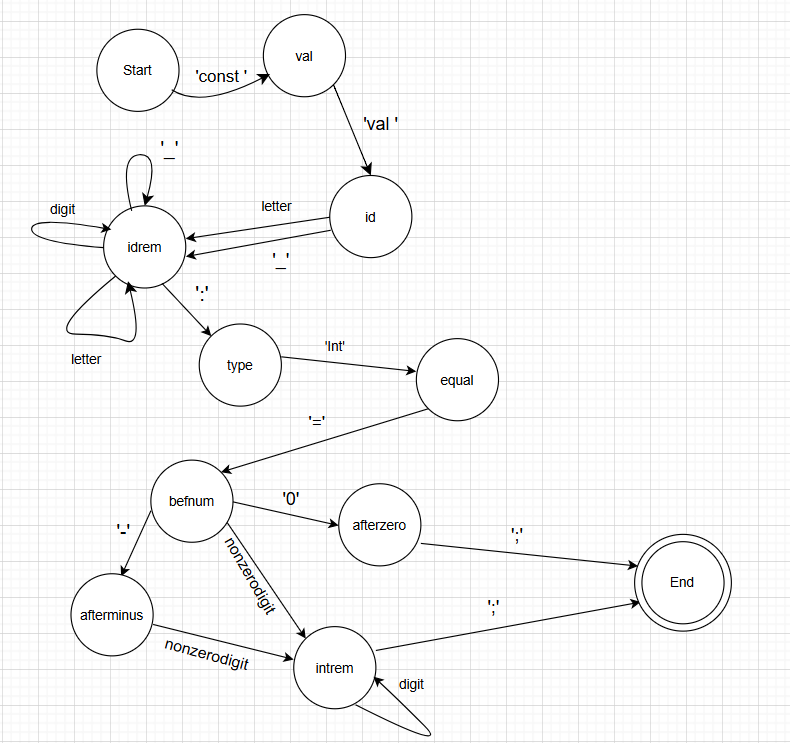

##　**Диагностика и нейтрализация синтаксических ошибок**
```
Разрабатываемый синтаксический анализатор построен на базе автоматной грамматики.
Реализация алгоритма Айронса для автоматной грамматики имеет следующую особенность: 
при возникновении синтаксической ошибки в процессе разбора с использованием автоматной грамматики, в дереве разбора всегда
будет только один недостроенный куст. Поскольку единственный недостроенный куст – это тот, во время
построения которого возникла синтаксическая ошибка, то это единственный куст,
к которому можно привязать оставшуюся входную цепочку символов.
```
## **Тестовые примеры**
**Корректная строка**
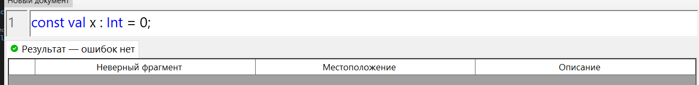
**Некорректная строка 1**
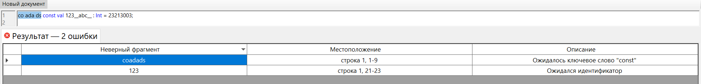
**Некорректная строка 2**
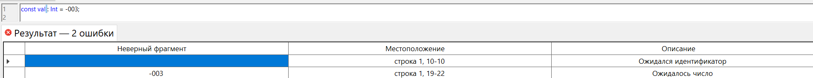
**Многострочность**
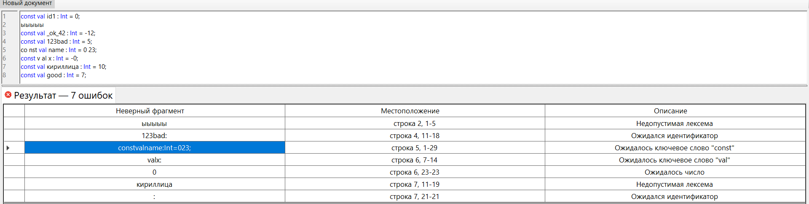

## **Грамматика Antlr**
```
grammar ConstVal;

start
    : (CONST VAL ID COLON INTKW ASSIGN NUMBER SEMI)* EOF
    ;
 
CONST      : 'const';
VAL        : 'val';
INTKW      : 'Int';
ASSIGN     : '=';
SEMI       : ';';
COLON      : ':';

ID : (LETTER | '_') (LETTER | DIGIT | '_')*;

NUMBER
    : '-' NONZERO DIGIT*
    | NONZERO DIGIT*
    | '0'
    ;

fragment LETTER : [a-zA-Z];
fragment DIGIT  : [0-9];
fragment NONZERO : [1-9];

WS : [ \t\r\n]+ -> skip;

ERROR_CHAR : . ;
```
## **Тестовые примеры**
#　**Корректная строка**

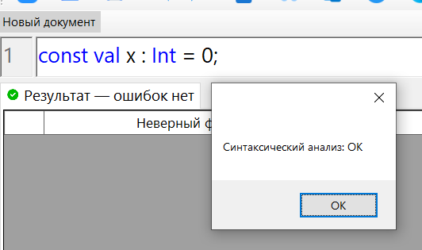

#　**Некорректная строка 1**

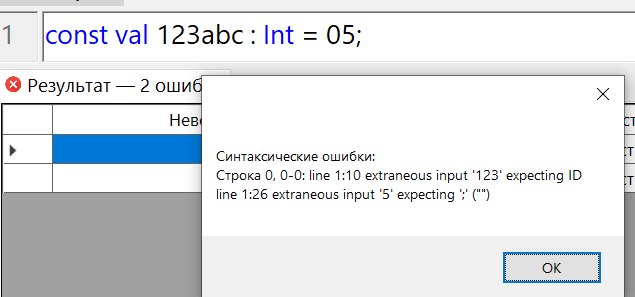

#　**Некорректная строка 2**

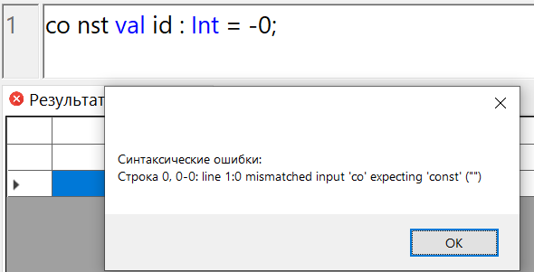

#　**Многострочность**

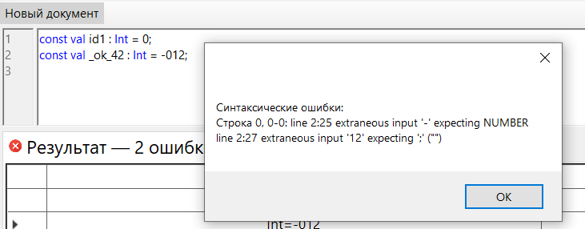
<a name="d"></a>
