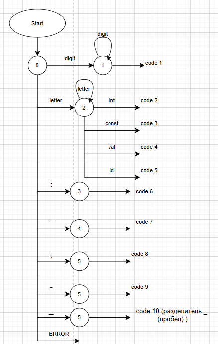
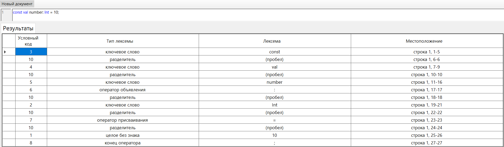
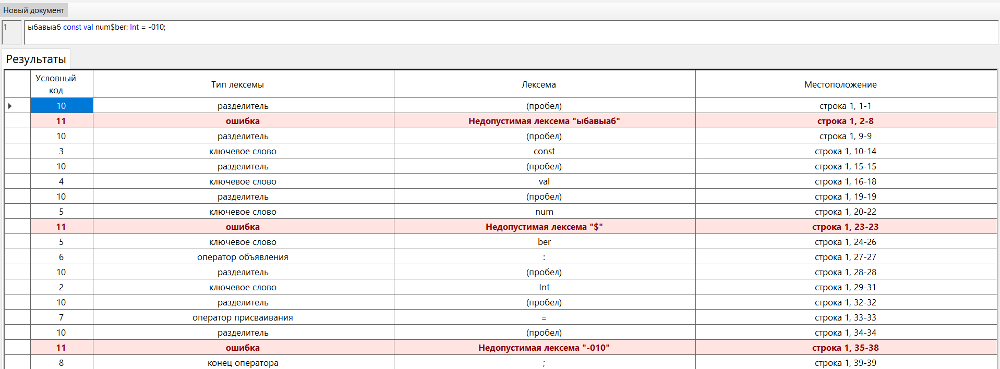
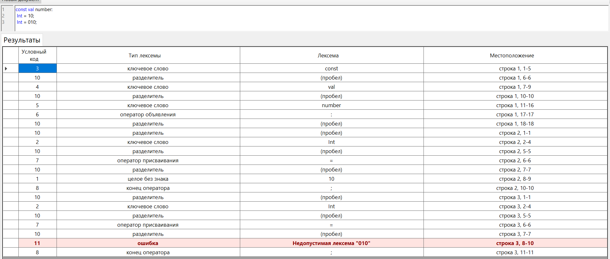
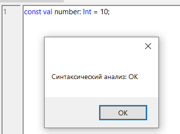
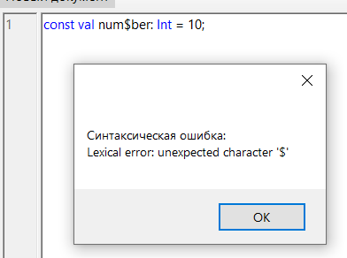
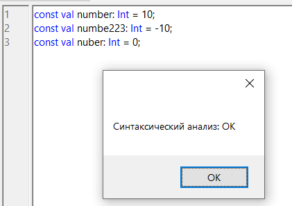

# Лабораторная работа №2. Разработка лексического анализатора (сканера)

## Цель работы: 
Изучить назначение и принципы работы лексического анализатора в структуре компилятора. Спроектировать алгоритм (диаграмму состояний) и выполнить программную реализацию сканера для выделения лексем из входного текста. Интегрировать разработанный модуль в ранее созданный графический интерфейс языкового процессора.

## **Автор:** 

 Cтудент группы АВТ-313 Геращенко Антон Евгеньевич

## Постановка задачи:
Разработать лексический анализатор (сканер) в соответствии с индивидуальным вариантом задания,
интегрировать его в приложение из лабораторной работы №1 и обеспечить наглядный вывод результатов; разработать грамматику , cгенерировать код лексера и парсера для анализа грамматики с помощью программного обеспечения FLEX&BISON, а затем внедрить и протестировать в программе.
  
# Вариант задания:
Вариант №40. Объявление целочисленной константы с инициализацией **(Kotlin)**
### Примеры корректных входных данных:
1) **const val x: Int = 10;**
2) **const val number: Int = -5;**
3) **const val index123: Int = 0;**
Допустимые лексемы: { 'const', 'val', 'Int', идентификатор, целое_число, '−', ':', '=', ';' }
  
# Диаграмма состояний:

## Описание:
Автомат начинает работу в состоянии Start (0) и далее, в зависимости от первого символа, выбирает ветку анализа:
1) цифра → целое число
2) буква → идентификатор или ключевое слово (Int, val, const)
3) ':' → оператор ':'
4) '=' → оператор '='
5) ';' → оператор ';'
6) '-' → оператор '-'
7) пробел → разделитель
8) Любой другой символ → **ошибка**
### Каждое состояние либо:
1) продолжает чтение (цикл), либо
2) завершает токен и возвращает его код.

# Тестовые примеры:
**Пример №1: корректная входная строка**

**Пример №2: некорректная входная строка**

**Пример №3: многострочность**

# Разработанная грамматика на основе варианта:
```
Vₜ = { 'a'..'z', 'A'..'Z', '0'..'9', ':', '=', ';', ' ', '-'}
 Vₙ = {
    <Программа>,
    <Список объявлений>,
    <Объявление>,
    <Идентификатор>,
    <Целое число>,
    <Положительное число>,
    <Ненулевая цифра>
    <Буква>,
    <Цифра>
 }

S = <Программа>

<Программа> → <Список объявлений>

<список объявлений> → <Объявление>
<Список объявлений> → <Список объявлений> <Объявление>

<Объявление> → 'const' 'val' <Идентификатор> ':' 'Int' '=' <Целое xисло> ';'

<Идентификатор> → <Буква>
<Идентификатор> → <Идентификатор> <Буква>
<Идентификатор> → <Идентификатор> <Цифра>

<Целое число> → '0'
<Целое число> → <Положительное число>
<Целое число> → '-'<Положительное число>

<Положительное число> → <Цифра>
<Положительное число> → <Положительное число> <Цифра>


<Буква> → 'a' | 'b' | ... | 'z' | 'A' | ... | 'Z'
<Цифра> → '0' | '1' | ... | '9'
<Ненулевая цифра> → '1' | ... | '9'
```
## Классификация грамматики
Тип: контекстно‑свободная грамматика (тип 2 по Хомскому). Так как сушествует правило, где в правой части произвольная последовательность терминалов и нетерминалов: <Идентификатор> → <Идентификатор> <Цифра>, но при этом в левой части всегда один нетерминальный символ. 
# Грамматика для FLEX:
```
%{
    #include "grammar.tab.h"
%}

%option noyywrap

%%

"const"        { return T_CONST; }
"val"          { return T_VAL; }
"Int"          { return T_INT; }

":"            { return T_COLON; }
"="            { return T_ASSIGN; }
";"            { return T_SEMI; }

-0[0-9]*      { fprintf(stderr, "Lexical error: invalid integer '%s'\n", yytext); exit(1); }

"-"            { return T_MINUS; }

0                 { yylval.intValue = 0; return T_INTLIT; }
[1-9][0-9]*         { yylval.intValue = atoi(yytext); return T_INTLIT; }

[a-zA-Z][a-zA-Z0-9]*  {
                        yylval.strValue = strdup(yytext);
                        return T_IDENT;
                     }

[ \t\r\n]+     {  }

. {
    fprintf(stderr, "Lexical error: unexpected character '%s'\n", yytext);
    exit(1);
}
%%
```
# Грамматика для BIZON:
```
%{
    #include <stdio.h>
    #include <stdlib.h>

    void yyerror(const char* s);
    int yylex(void);
%}

%union {
    int intValue;
    char* strValue;
}

%token T_CONST T_VAL T_INT
%token <strValue> T_IDENT
%token <intValue> T_INTLIT
%token T_COLON T_ASSIGN T_SEMI
%token T_MINUS
 

%%

program:
      decl_list
    ;

decl_list:
      decl
    | decl_list decl
    ;

decl:
      T_CONST T_VAL T_IDENT T_COLON T_INT T_ASSIGN number T_SEMI
    ;

number:
      T_INTLIT
    | T_MINUS T_INTLIT
    ;

%%

void yyerror(const char* s)
{
    fprintf(stderr, "Syntax error: %s\n", s);
}
```
## Грамматика FLEX:
Тип: регулярная грамматика (тип 3 по Хомскому). FLEX использует регулярные выражения, которые соответствуют праволинейным грамматикам вида A → aB | a | ε.
## Грамматика Bison: 
Тип: контекстно‑свободная грамматика (тип 2 по Хомскому).
Bison строит LALR(1)-парсер, который работает только с КС-грамматиками.
## Примеры допустимых строк:
1) const val number: Int = 10;
2) const val number: Int = -101;
3) const val number: Int = 0;
# Тестовые примеры:

## **Пример №1: правильная строка:**

## **Пример №2: неправильная строка:**

## **Пример №3: несколько строк:**

